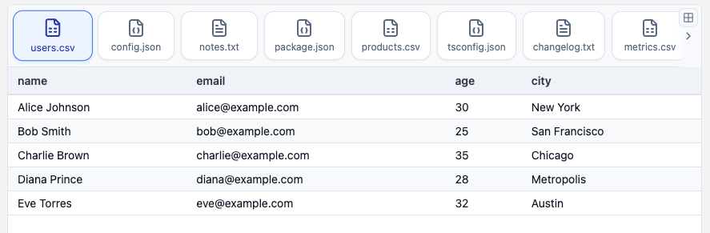

# react-file-carousel

[](https://www.npmjs.com/package/react-file-carousel)
[](https://opensource.org/licenses/MIT)

A lightweight React file preview carousel: file bar (icons + names) and preview pane. Supports CSV, JSON, text, YAML, XML, Markdown, log, and TSV. Customize with class names, component overrides, or CSS variables.

**[Live demo](https://react-file-carousel.github.io/react-file-carousel/)**

[](https://react-file-carousel.github.io/react-file-carousel/)

## Install

```bash
npm install react-file-carousel
```

Import default styles once (e.g. in `main.tsx`):

```ts
import 'react-file-carousel/dist/index.css';
```

**Requirements:** React and react-dom ^18.0.0 or ^19.0.0 (peer deps). The package uses lucide-react and papaparse.

## Quick example

```tsx
import { FileCarousel, type FileData } from 'react-file-carousel';

const files: FileData[] = [
  { id: '1', name: 'data.json', type: 'json', content: '{"foo": "bar"}' },
  { id: '2', name: 'readme.txt', type: 'text', content: 'Hello world' },
];

export function App() {
  return (
    <div style={{ height: 400 }}>
      <FileCarousel files={files} />
    </div>
  );
}
```

## Customize the UI

Use one or more of:

- **`classNames`** – Your own classes per part (e.g. Tailwind). Keys: `root`, `bar`, `tab`, `tabActive`, `iconWrap`, `icon`, `name`, `preview`, `table*`, `pre`, `code`, `error`, `empty`. See [docs/styling.md](docs/styling.md#1-class-names).
- **`components`** – Custom `Tab` and/or `Table` (e.g. MUI). See [docs/styling.md](docs/styling.md#2-component-overrides).
- **CSS variables** – Set `--rfc-*` on a parent to theme. See [docs/styling.md](docs/styling.md#3-css-variables).
- **`fileIcons`** – Map of file type → icon component (`FileIconProps`: `size?`, `className?`).

Short example:

```tsx
<FileCarousel files={files} classNames={{ tab: 'rounded-lg', tabActive: 'bg-blue-100' }} />
```

Full examples and variable list: [docs/styling.md](docs/styling.md).

## Custom settings

| Prop | Description |
|------|-------------|
| `barPosition` | `'top' \| 'bottom' \| 'left' \| 'right'` (default: `'top'`) |
| `defaultExpanded` / `expanded` / `onExpandedChange` | Grid mode (multi-row or multi-column) |
| `defaultActiveId` / `activeId` / `onActiveChange` | Initial or controlled active file |
| `jsonIndent` | JSON indent spaces (default: 2) |
| `className` | Root container class |

Full API: [docs/api.md](docs/api.md).

## Demo

- **Live:** [react-file-carousel.github.io/react-file-carousel](https://react-file-carousel.github.io/react-file-carousel/)
- **Local:** `cd demo && npm install && npm run dev` then open the URL shown (e.g. http://localhost:5173).

Demo is deployed via [.github/workflows/deploy-demo.yml](.github/workflows/deploy-demo.yml). Enable **Settings → Pages → GitHub Actions**.

## Development

```bash
npm install && npm run build    # build library
npm run dev                     # watch
cd demo && npm install && npm run dev   # run demo
```

## License

MIT — see [LICENSE](LICENSE).
